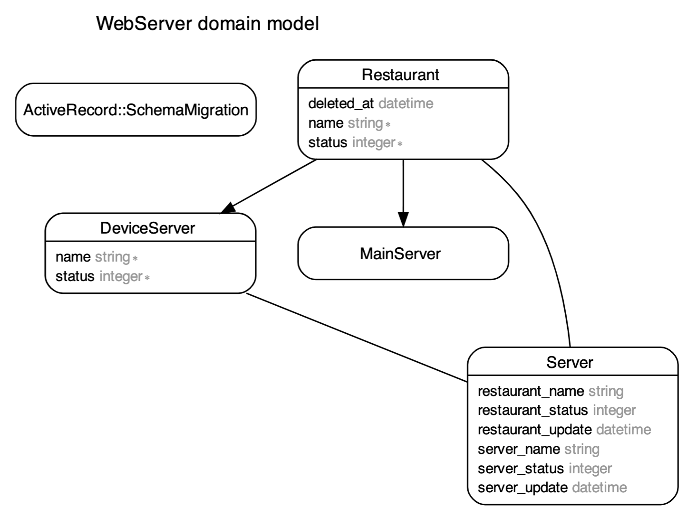

# Web Server

This web application allows you to know the status of the restaurants and devices/server.

## Diagram model

<p align="left"></p>

## Pre-requisities 

To run this project make sure you have installed the following technologies:

* Ruby  v2.7.3
* Rails v5.2.8.1
* Node  v16.14.2
* Yarn  v1.22.19

## Getting Started

Clone the repository in the folder 

```console
  git clone git@github.com:denisseee/server_web.git server_web
```

Install the dependencies

```console
  cd server_web
  bundle install
```

Setup the database

```console
  rails db:setup
```

And run the next command to ensure constant updating of the servers:

```console
  clockwork clock.rb
```

## Run the project

From the terminal:

```console
  rails s
```

Check the project in development:

```console
  http://localhost:3000/
```

## See the application

Check the project in production:

From Heroku: [Web Server](https://www.google.cl/)
